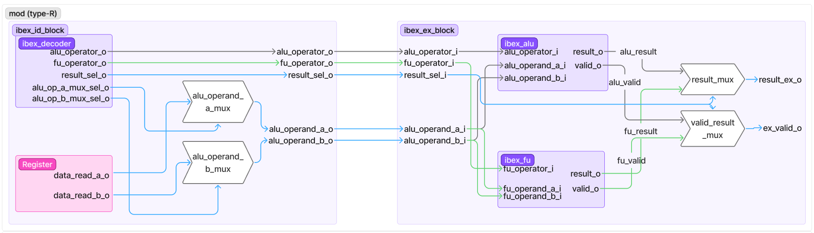
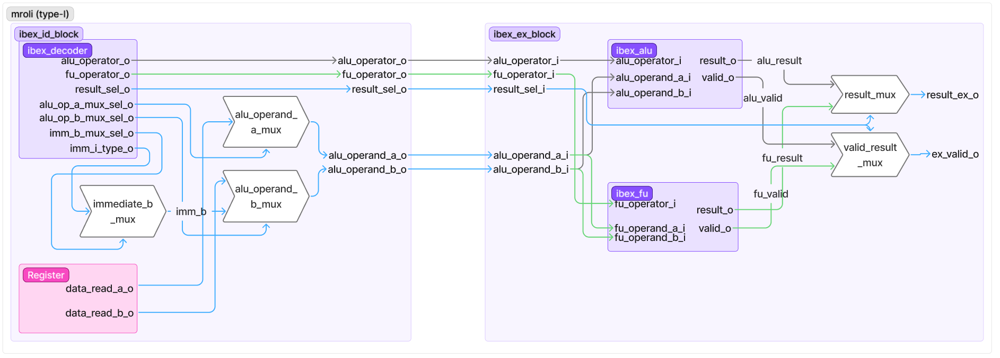
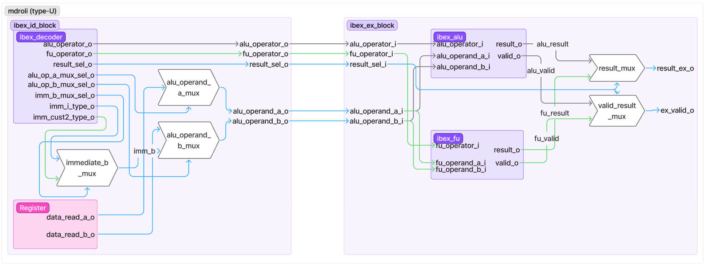
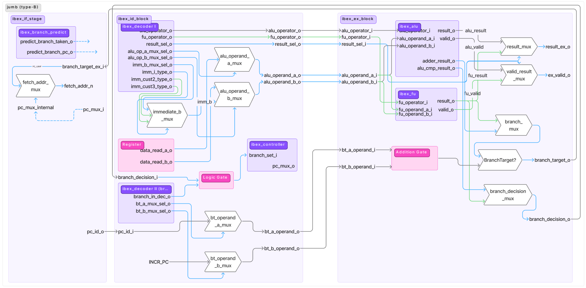

# Modification du Hardware

Dans ce dossier, on peut trouver un design RTL qui comprend les instructions custom `mod`, `mroli`, `mdroli`, `jumb`.

Voici comment utiliser ce processeur avec la simulation `simple_system`:

###### Configuration du processeur :

La configuration est se trouve dans le fichier **ibex_simple_system.sv** :

```
  parameter bit                 SecureIbex               = 1'b0;
  parameter int unsigned        LockstepOffset           = 1;
  parameter bit                 ICacheScramble           = 1'b0;
  parameter bit                 PMPEnable                = 1'b0;
  parameter int unsigned        PMPGranularity           = 0;
  parameter int unsigned        PMPNumRegions            = 4;
  parameter int unsigned        MHPMCounterNum           = 0;
  parameter int unsigned        MHPMCounterWidth         = 40;
  parameter bit                 RV32E                    = 1'b0;
  parameter ibex_pkg::rv32m_e   RV32M                    = `RV32M;
  parameter ibex_pkg::rv32b_e   RV32B                    = `RV32B;
  parameter ibex_pkg::rv32zc_e  RV32ZC                   = `RV32ZC;
  parameter ibex_pkg::regfile_e RegFile                  = `RegFile;
  parameter bit                 BranchTargetALU          = 1'b0;
  parameter bit                 WritebackStage           = 1'b0;
  parameter bit                 ICache                   = 1'b0;
  parameter bit                 DbgTriggerEn             = 1'b0;
  parameter bit                 ICacheECC                = 1'b0;
  parameter bit                 BranchPredictor          = 1'b0;
  parameter                     SRAMInitFile             = "";

```

Pour l'utiliser il faut le mettre dans le dossier **ibex/examples/simple_system/rtl**, après avoir cloné le processeur Ibex.

###### Fichier System Verilog du processeur :

Les fichiers du processeur complet se trouvent dans le dossier **./rtl**, il faut les mettre dans le dossier **ibex/rtl**. Pour lancer la simulation, utiliser le fichier `Makefile` au même niveau que le dossier **ibex**.

Utiliser la commande :

```
make setup_sim
```

###### Exemples de test :

Utiliser le code C `test_mod.c` pour tester les instructions custom. Ce fichier teste les quatre instructions et produit un fichier log qui compare les résultats des instructions avec ceux attendus. Le fichier doit être situé au même niveau que le `Makefile`.

Utiliser les commandes suivantes pour compiler et exécuter le code. Assurer vous que la toolchain custom est bien définie comme toolchain à utiliser.

```
export PATH=/opt/riscv_custom/bin:$PATH     # Définision de la toolchain
make test_mod.elf    # Commande de compilation 
make test_mod.run    # Commande d'exécution
```

<u>Notes :</u>

`test_mod` peut être remplacé par le nom de votre fichier .c pour la compilation et l'exécution.

## Schémas synthétiques des modifications apportées au processeur

Nous avons voulu implémenter des instructions de type similaire à l’ISA RISC-V afin de couvrir le plus de cas différents possible. Pour chaque instruction, veuillez trouver un schéma synthétique qui explique quels signaux ont été réutilisés (*en bleu*) et quels signaux ont été ajoutés (*en vert*).

Certains mécanismes ont été simplifiés, notamment pour le Branch Predictor, mais cela donne une vue d’ensemble des signaux impliqués. Les flèches en pointillés montrent que le chemin a été résumé.

###### Instruction MOD, type-R :



###### Instruction MROLI, type-I :



###### Instruction MDROLI, type-U :



###### Instruction JUMB, type-B :



# Perspectives

L’optimisation du **Branch Predictor**, qui permet d’économiser un cycle lorsqu’on a une instruction de type jump ou branch, ne montre pas encore d’amélioration sur le nombre de cycles et d’instructions. Il reste du débogage à faire. Vous pouvez observer les modifications qui ont déjà été apportées dans les schémas.
